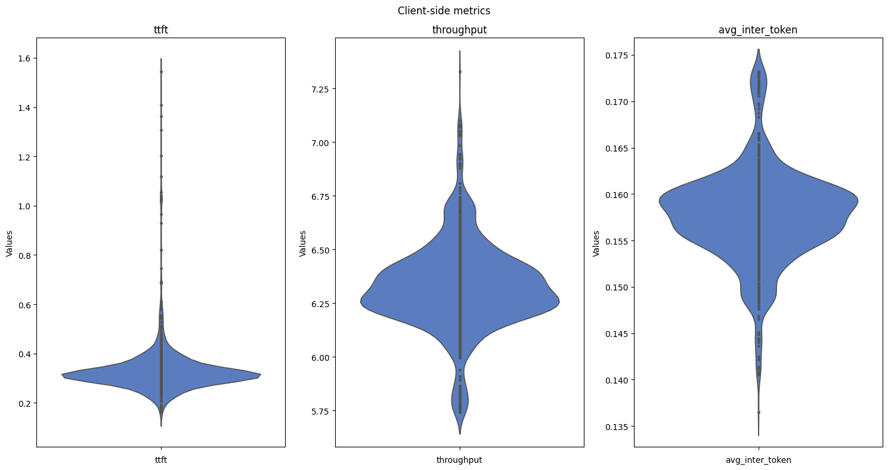

# Comparison of LLM Inference Platforms
This repo hosts a Python tool that is used to load test LLMs. Here we present some key results for popular inference servers.

For each test run, we analyze two sets of logs: the ones generated by our Python tool, and the ones generated by the inference server. We track similar metrics from both sources to observe the latency imposed by our tool. In practice, production setups involve software middleware for implementing custom batching/caching. Measuring metrics at two points also helps determine the latency added by such middleware.

## vLLM

| Metric    | Logged by tool | Logged by vLLM | Comments
| -------- | ------- | ------- | ------- |
| Time to first-token (TTFT)  | 0.334s | 0.198s | View calculation for vLLM metrics [here](https://docs.google.com/spreadsheets/d/1RQtsavNX1FAkR_XZK6WpjOiutz3b3B6Y2rV6vU6OuAU/edit?usp=sharing) |
| Token Throughput | 6.33 tokens/s | 6.33 tokens/s | |
| Inter-token Latency    | 0.158s | 0.157s | |

### About the test
1. We test performance on Llama-3.1-8B-Instruct, with 8-bit quantization using [bitsandbytes](https://github.com/bitsandbytes-foundation/bitsandbytes).
2. We use 500 random samples from the [Share GPT dataset](https://huggingface.co/datasets/RyokoAI/ShareGPT52K) as prompts for our requests. A practice consistent with [vLLM's inhouse benchmarks](https://simon-mo-workspace.observablehq.cloud/vllm-dashboard-v0/perf).
3. There is no network latency as the tool is run on the same node as vLLM.
4. The node runs a single NVIDIA L4 (VRAM 24GB), which is NOT production grade hardware. Results will be better on A100s and H100s.
5. The logs can be found at ```output/sharegpt_test```.
6. Number of concurrent users was slowly increased to 50 users in the first 20s of the test, and the total test duration was 900s.

### Tool Metrics Visualization
The following results are at the level of individual requests. This represents the observations of a single user querying the LLM. The metrics logged at the server level are distributed across all concurrent user queries.
```
==================== Load Test Results =====================
Total Requests:           1130
Successful Requests:      1130
Failed Requests:          0
Test Duration:            900.00s
Requests/sec:             1.26

---------------- Time to First Token (TTFT) ----------------
Average:             0.3341s
95th %ile:           0.4481s
99th %ile:           1.0035s

--------------------- Token Throughput ---------------------
Average:             6.33 tokens/s
95th %ile:           6.69 tokens/s

------------------- Inter-Token Latency --------------------
Average:             0.1578s
95th %ile:           0.1653s

--------------------- Request Duration ---------------------
Average:             31.6773s
95th %ile:           33.2754s
```




## Navigating the repo
1. ```load_test.py``` is used to run the load test job.
2. ```output/``` contains logs from various runs.
3. ```configs/``` contains yaml configurations used by ```load_test.py```.
4. ```requests/``` contains request that ```load_test.py``` uses to conduct the test. A json is created per test run, that accomodates the request format expected by the inference server being tested. It also contains request preprocessing scripts from different test runs.
